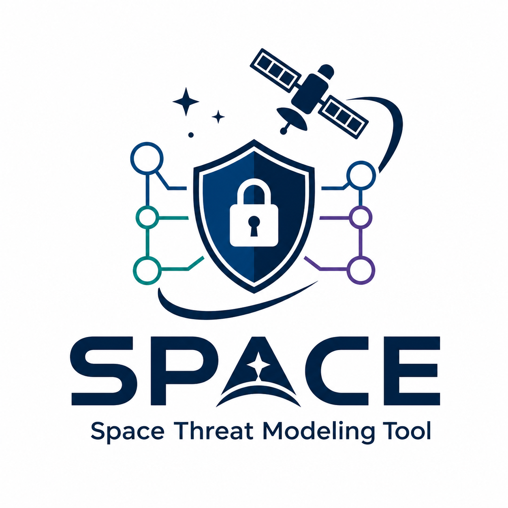
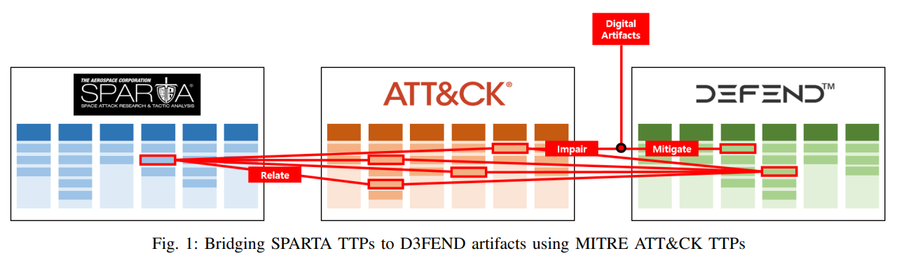
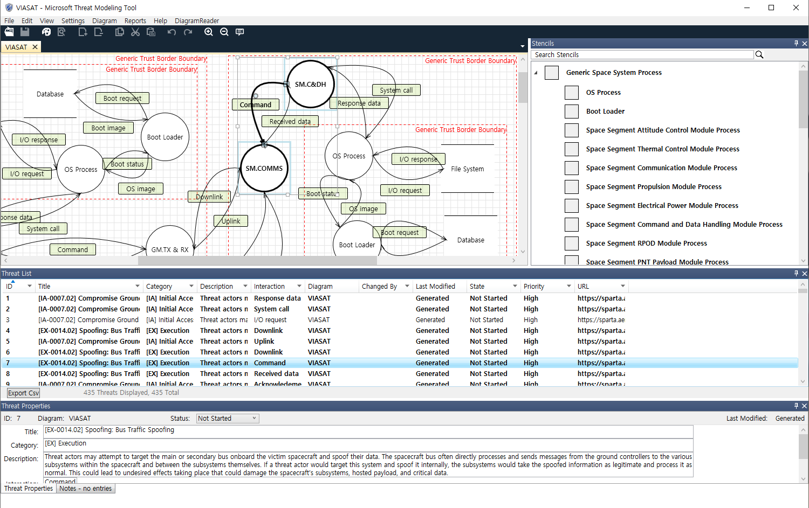

<p align="center">
  
</p>

<h1 align="center">Space Systems Threat Modeling Template</h1>

<p align="center">
  A domain-specific template (<code>.tb7</code>) for the <a href="https://learn.microsoft.com/en-us/azure/security/develop/threat-modeling-tool">Microsoft Threat Modeling Tool</a> that <b>automatically identifies space-domain cyber threats</b> when users build Data Flow Diagrams of satellite and ground system architectures.
</p>

---

## About

As space systems become increasingly interconnected and software-defined, their cyber-attack surface continues to expand. However, existing threat modeling tools and templates do not address the unique threat landscape of the space domain.

This template enables **automated, space-specific threat identification** within the Microsoft Threat Modeling Tool by bridging three cybersecurity knowledge bases — [SPARTA](https://sparta.aerospace.org), [MITRE ATT&CK](https://attack.mitre.org), and [D3FEND](https://d3fend.mitre.org). SPARTA and D3FEND cannot be directly connected; MITRE ATT&CK serves as the logical intermediary that maps space-specific threats (SPARTA) to defensive artifact properties (D3FEND DAO) embedded in each stencil.

When a user constructs a Data Flow Diagram of a satellite or ground system architecture, the tool automatically generates relevant SPARTA-mapped threats based on the components and data flows in the diagram.

<p align="center">
  
</p>

## Prerequisites

| Requirement | Note |
|---|---|
| **Microsoft Threat Modeling Tool** | Free download from [Microsoft](https://aka.ms/threatmodelingtool). Windows only. |

No other software or library is required.

## Quick Start

1. Download the `.tb7` template file from this repository.
2. Open Microsoft Threat Modeling Tool.
3. Go to **File → New Template** (or **Open Template**) and load the downloaded `.tb7` file.
4. Create a new model using the loaded template.
5. Build a Data Flow Diagram by dragging stencils (satellite bus, ground station, TT&C link, payload, etc.) onto the canvas and connecting them with data flows.
6. Switch to the **Analysis View** — the tool automatically generates SPARTA-mapped threats based on the diagram.

<p align="center">
  
</p>

## Paper

> **Towards Automated Threat Modeling for Space Systems via SPARTA Matrix**
>
> Joonhyuk Park and Seungjoo Kim
>
> Workshop on Security of Space and Satellite Systems (SpaceSec) 2025, co-located with NDSS 2025
>
> <!-- [Paper link] | [Slides] -->

## Citation

If you use this template in your research, please cite:

```bibtex
@inproceedings{park2025spacetmt,
  title     = {Towards Automated Threat Modeling for Space Systems via SPARTA Matrix},
  author    = {Park, Joonhyuk and Kim, Seungjoo},
  booktitle = {Workshop on Security of Space and Satellite Systems (SpaceSec) 2025,
               co-located with NDSS 2025},
  year      = {2025}
}
```

## License

This project is licensed under the [MIT License](LICENSE).

## Contact

- **Joonhyuk Park** — Korea University, School of Cybersecurity
<!-- - Email: -->
<!-- - Lab website: -->
